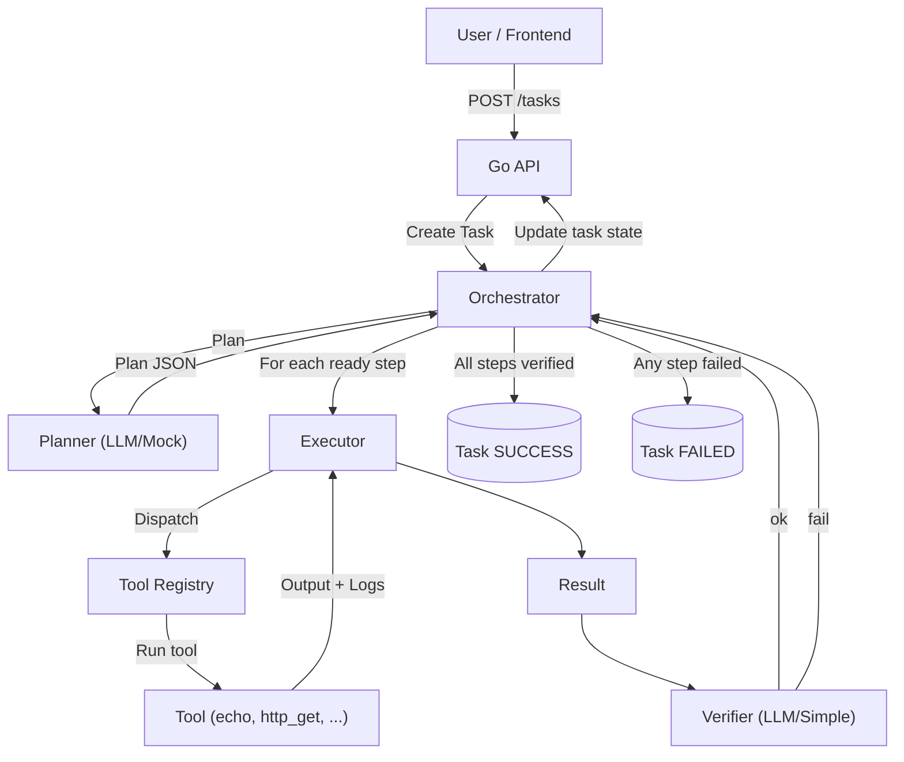

# Agent Orchestrator (Go + React)

## Overview
Planner → Executor(s) → Verifier pipeline with a Go backend and React frontend. Gemini integration is stubbed for now; a mock planner and simple verifier are included. Tools are pluggable (echo, http_get provided).

## Flowchart


## Project Structure
- backend/
  - cmd/server: entrypoint
  - internal/{api,agents,models,orchestrator,providers/gemini,tools}
- frontend/
  - Vite + React + TS app

## Run Backend
```
cd backend
GOOGLE_API_KEY=your_key # optional for future Gemini integration
go run ./cmd/server
```
Server listens on :8080.

## Run Frontend
```
cd frontend
npm install
npm run dev
```
App runs on http://localhost:5173 and talks to backend at http://localhost:8080.

## API
- POST /tasks { query, context? } → Task
- POST /tasks/start/{id} → 202 Accepted, starts orchestration
- GET /tasks → list
- GET /tasks/{id} → details (plan, steps, results)

## Notes
- Planner: rule-based mock. Replace with Gemini client in `internal/providers/gemini` and a real planner in `internal/agents`.
- Safety: tools are whitelisted. No arbitrary code execution.
- Persistence: in-memory for MVP. Swap with a store if needed.

### Gemini (optional)
- Default build uses a mock Gemini client and the rule-based planner.
- Enable LLM planner and/or verifier:
  - `USE_LLM_PLANNER=1` and/or `USE_LLM_VERIFIER=1`
  - Set `GOOGLE_API_KEY` to your Gemini API key.
- To build with the real Gemini SDK, compile with the `gemini` build tag:
  - `go build -tags=gemini ./cmd/server`
  - Or run: `GOOGLE_API_KEY=... USE_LLM_PLANNER=1 go run -tags=gemini ./cmd/server`

### .env support
- The backend loads environment variables from `.env` in `backend/` if present.
- Copy `backend/.env.example` to `backend/.env` and fill values:
  - `PORT`, `GOOGLE_API_KEY`, `USE_LLM_PLANNER`, `USE_LLM_VERIFIER`.

## TODO
- Orchestrator: per-step timeouts, retries with backoff, and cancellation.
- Persistence: store tasks/plans/results in SQLite with a simple repository.
- Live updates: SSE endpoint `/tasks/{id}/events` for streaming logs/status.
- LLM hardening: JSON schema enforcement and robust parsing for planner/verifier.
- Tools: add shell sandbox, file ops, and HTTP POST/JSON tools; registry config.
- Auth: API keys or token-based auth for write endpoints.
- Frontend: subscribe to SSE, improve task detail UI, and error states.
- Reverse proxy: optional Nginx to serve frontend and proxy `/api` to backend.
- Tests: unit tests for agents/tools and integration tests for orchestration.

## Notes
- Planner: rule-based mock. Replace with Gemini client in `internal/providers/gemini` and a real planner in `internal/agents`.
- Safety: tools are whitelisted. No arbitrary code execution.
- Persistence: in-memory for MVP. Swap with a store if needed.

 
