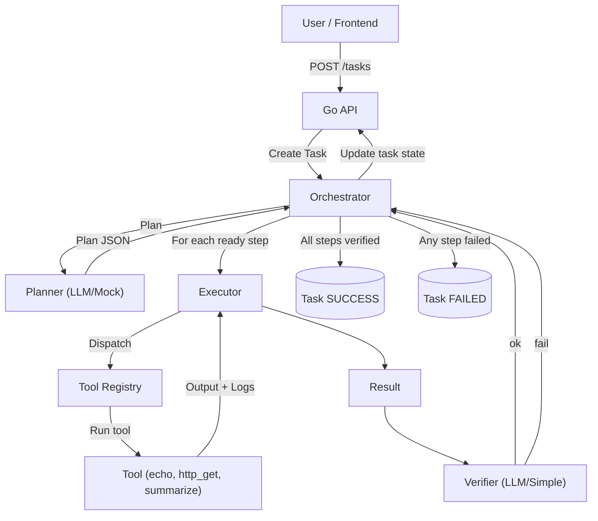

# Agent Orchestrator (Go + React)

## Overview
Planner → Executor(s) → Verifier pipeline with a Go backend and React frontend. LLM integration is provider-agnostic (OpenAI, Anthropic, Gemini via HTTP) with a mock fallback. Tools are pluggable (echo, http_get, summarize).
New tools: html_to_text, http_post_json, llm_answer.

## Flowchart


## Project Structure
- backend/
  - cmd/server: entrypoint
  - internal/{api,agents,models,orchestrator,providers/{llm,gemini},tools}
- frontend/
  - Vite + React + TS app

## Run Backend
```
cd backend
go run ./cmd/server
```
Server listens on :8080.

## Run Frontend
```
cd frontend
npm install
npm run dev
```
App runs on http://localhost:5173 and talks to backend at http://localhost:8080.

## API
- POST `/tasks` { query, context? } → create Task (status `PENDING`)
- POST `/tasks/plan/{id}` → compute plan only, return plan (task becomes `PLANNED`)
- POST `/tasks/execute/{id}` → execute an existing plan without re-planning
- POST `/tasks/start/{id}` → plan + execute (full flow)
- GET `/tasks` → list
- GET `/tasks/{id}` → details (includes plan, steps, results)

## Notes
- Planner: rule-based mock by default; when enabled, planner/verifier use the provider configured under `internal/providers/llm`.
- Referencing previous outputs: set a string input exactly to `{{step:ID.output}}` to pass a prior step’s output into a later step (e.g., use `summarize` on `http_get` output).
- Safety: tools are whitelisted. No arbitrary code execution.
- Persistence: in-memory for MVP. Swap with a store if needed.


### Tools and Examples
- http_post_json
  - Purpose: Call JSON APIs via POST.
  - Inputs: `url: string`, `json: any|string`, `headers?: map[string]string`, `timeout_ms?: number`
  - Example:
    - `{"tool":"http_post_json","inputs":{"url":"https://httpbin.org/post","json":{"hello":"world"}}}`
  - Output: Response body as string; logs include HTTP status and content-type.

- html_to_text
  - Purpose: Convert HTML string to readable text (strips scripts/styles, compacts whitespace).
  - Inputs: `html: string`
  - Example chain: `http_get` → `html_to_text` → `summarize`
    - step1: `{ "tool":"http_get", "inputs": {"url":"https://example.com"} }`
    - step2: `{ "tool":"html_to_text", "inputs": {"html":"{{step:step1.output}}"}, "deps":["step1"] }`
    - step3: `{ "tool":"summarize", "inputs": {"text":"{{step:step2.output}}"}, "deps":["step2"] }`

- llm_answer
  - Purpose: Directly ask the configured LLM to answer a question concisely.
  - Inputs: `text: string` (or `question: string`), `instructions?: string`
  - Example:
    - `{ "tool":"llm_answer", "inputs": {"text": "What is an AI agent?"} }`

### LLM Providers
- Enable LLM planner and/or verifier by setting:
  - `USE_LLM_PLANNER=1` and/or `USE_LLM_VERIFIER=1`
- Configure provider via env:
  - `LLM_PROVIDER` = `openai` | `anthropic` | `gemini`
  - `LLM_MODEL` (optional; sensible default picked if empty)
  - API Key envs: set the one matching your provider
    - `OPENAI_API_KEY`
    - `ANTHROPIC_API_KEY`
    - `GOOGLE_API_KEY`
- If no provider/key is set, a mock LLM is used.

### .env support
- The backend loads environment variables from `.env` in `backend/` if present.
- Copy `backend/.env.example` to `backend/.env` and fill values:
  - `PORT`, `USE_LLM_PLANNER`, `USE_LLM_VERIFIER`, `LLM_PROVIDER`, `LLM_MODEL`, and provider API key.

## TODO
- Orchestrator: per-step timeouts, retries with backoff, and cancellation.
- Persistence: store tasks/plans/results in SQLite with a simple repository.
- Live updates: SSE endpoint `/tasks/{id}/events` for streaming logs/status.
- LLM hardening: JSON schema enforcement and robust parsing for planner/verifier.
- Tools: add shell sandbox, file ops, and HTTP POST/JSON tools; registry config.
- Auth: API keys or token-based auth for write endpoints.
- Frontend: subscribe to SSE, improve task detail UI, and error states.
- Reverse proxy: optional Nginx to serve frontend and proxy `/api` to backend.
- Tests: unit tests for agents/tools and integration tests for orchestration.

## Notes
- Planner: rule-based mock by default; when enabled, planner/verifier use the provider configured under `internal/providers/llm`.
- Planning/Execution: you can preview steps via `/tasks/plan/{id}` and then run them via `/tasks/execute/{id}`; or do both with `/tasks/start/{id}`.
- Referencing previous outputs: use `{{step:ID.output}}` as an input value to inject the output string of a prior step (e.g., `summarize` after `http_get`).
- Safety: tools are whitelisted. No arbitrary code execution.
- Persistence: in-memory for MVP. Swap with a store if needed.

 
